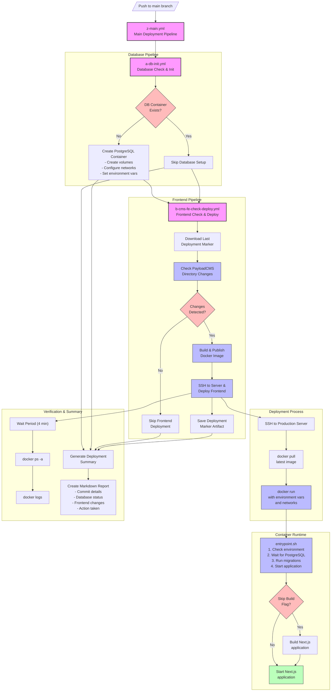

```mermaid
flowchart TB
    GitPush[/"Push to main branch"/] --> MainWorkflow["z-main.yml\nMain Deployment Pipeline"]
    
    MainWorkflow --> DBCheckInit
    
    subgraph "Database Pipeline"
        DBCheckInit["a-db-init.yml\nDatabase Check & Init"]
        DBCheckInit --> CheckDBExists{"DB Container\nExists?"}
        CheckDBExists -->|No| CreateDB["Create PostgreSQL Container\n- Create volumes\n- Configure networks\n- Set environment vars"]
        CheckDBExists -->|Yes| SkipDB["Skip Database Setup"]
    end
    
    CreateDB --> CMSFECheck
    SkipDB --> CMSFECheck
    
    subgraph "Frontend Pipeline"
        CMSFECheck["b-cms-fe-check-deploy.yml\nFrontend Check & Deploy"]
        CMSFECheck --> DownloadMarker["Download Last\nDeployment Marker"]
        DownloadMarker --> DetectChanges["Check PayloadCMS\nDirectory Changes"]
        DetectChanges --> ChangesExist{"Changes\nDetected?"}
        
        ChangesExist -->|Yes| BuildPublish["Build & Publish\nDocker Image"]
        BuildPublish --> DeployFE["SSH to Server &\nDeploy Frontend"]
        DeployFE --> SaveMarker["Save Deployment\nMarker Artifact"]
        
        ChangesExist -->|No| SkipFE["Skip Frontend\nDeployment"]
    end
    
    subgraph "Deployment Process"
        DeployFE --> SSHToServer["SSH to Production Server"]
        SSHToServer --> PullImage["docker pull\nlatest image"]
        PullImage --> RunContainer["docker run\nwith environment vars\nand networks"]
    end
    
    subgraph "Container Runtime"
        RunContainer --> Entrypoint["entrypoint.sh\n1. Check environment\n2. Wait for PostgreSQL\n3. Run migrations\n4. Start application"]
        Entrypoint --> CheckBuildSkipped{"Skip Build\nFlag?"}
        CheckBuildSkipped -->|Yes| BuildNextJS["Build Next.js\napplication"]
        CheckBuildSkipped -->|No| StartApp["Start Next.js\napplication"]
        BuildNextJS --> StartApp
    end
    
    subgraph "Verification & Summary"
        DeployFE --> WaitPeriod["Wait Period (4 min)"]
        WaitPeriod --> CheckContainers["docker ps -a"]
        CheckContainers --> CheckLogs["docker logs\n<containerId>"]
        
        SkipDB --> DeploySummary["Generate Deployment\nSummary"]
        CreateDB --> DeploySummary
        SkipFE --> DeploySummary
        SaveMarker --> DeploySummary
        DeploySummary --> MarkdownReport["Create Markdown Report\n- Commit details\n- Database status\n- Frontend changes\n- Action taken"]
    end
    
    classDef workflow fill:#f9f,stroke:#333,stroke-width:2px
    classDef process fill:#bbf,stroke:#333,stroke-width:1px
    classDef decision fill:#fbb,stroke:#333,stroke-width:1px
    classDef container fill:#bfb,stroke:#333,stroke-width:1px
    
    class MainWorkflow,DBCheckInit,CMSFECheck workflow
    class DetectChanges,BuildPublish,DeployFE,RunContainer,Entrypoint process
    class CheckDBExists,ChangesExist,CheckBuildSkipped decision
    class StartApp container
```
