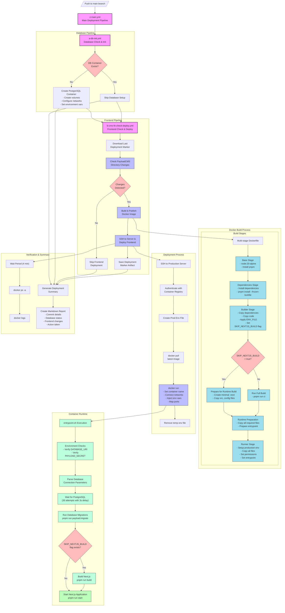

```mermaid
flowchart TB
    GitPush[/"Push to main branch"/] --> MainWorkflow["z-main.yml\nMain Deployment Pipeline"]
    
    MainWorkflow --> DBCheckInit
    
    subgraph "Database Pipeline"
        DBCheckInit["a-db-init.yml\nDatabase Check & Init"]
        DBCheckInit --> CheckDBExists{"DB Container\nExists?"}
        CheckDBExists -->|No| CreateDB["Create PostgreSQL Container\n- Create volumes\n- Configure networks\n- Set environment vars"]
        CheckDBExists -->|Yes| SkipDB["Skip Database Setup"]
    end
    
    CreateDB --> CMSFECheck
    SkipDB --> CMSFECheck
    
    subgraph "Frontend Pipeline"
        CMSFECheck["b-cms-fe-check-deploy.yml\nFrontend Check & Deploy"]
        CMSFECheck --> DownloadMarker["Download Last\nDeployment Marker"]
        DownloadMarker --> DetectChanges["Check PayloadCMS\nDirectory Changes"]
        DetectChanges --> ChangesExist{"Changes\nDetected?"}
        
        ChangesExist -->|Yes| BuildPublish["Build & Publish\nDocker Image"]
        BuildPublish --> DeployFE["SSH to Server &\nDeploy Frontend"]
        DeployFE --> SaveMarker["Save Deployment\nMarker Artifact"]
        
        ChangesExist -->|No| SkipFE["Skip Frontend\nDeployment"]
    end
    
    subgraph "Docker Build Process"
        BuildPublish --> DockerBuildStages["Multi-stage Dockerfile"]
        
        subgraph "Build Stages"
            DockerBuildStages --> BaseImage["Base Stage\n- node:20-alpine\n- Install pnpm"]
            BaseImage --> DepsStage["Dependencies Stage\n- Install dependencies\n- pnpm install --frozen-lockfile"]
            DepsStage --> BuilderStage["Builder Stage\n- Copy dependencies\n- Copy code\n- Apply ENV_FILE\n- Set SKIP_NEXTJS_BUILD flag"]
            
            BuilderStage --> SkipNextBuild{"SKIP_NEXTJS_BUILD\n= true?"}
            SkipNextBuild -->|Yes| PrepareRuntime["Prepare for Runtime Build\n- Create minimal .next\n- Copy src, config files"]
            SkipNextBuild -->|No| RunBuild["Run Full Build\n- pnpm run ci"]
            
            PrepareRuntime --> RuntimePrep["Runtime Preparation\n- Copy all required files\n- Prepare entrypoint"]
            RunBuild --> RuntimePrep
            
            RuntimePrep --> RunnerStage["Runner Stage\n- Setup production env\n- Copy all files\n- Set permissions\n- Set entrypoint"]
        end
    end
    
    subgraph "Deployment Process"
        DeployFE --> SSHToServer["SSH to Production Server"]
        SSHToServer --> AuthGHCR["Authenticate with\nContainer Registry"]
        AuthGHCR --> CreateEnvFile["Create Prod Env File"]
        CreateEnvFile --> PullImage["docker pull\nlatest image"]
        PullImage --> RunContainer["docker run\n- Set container name\n- Connect networks\n- Inject env vars\n- Map ports"]
        RunContainer --> CleanupEnvFile["Remove temp env file"]
    end
    
    subgraph "Container Runtime"
        RunContainer --> EntrypointScript["entrypoint.sh Execution"]
        
        EntrypointScript --> EnvCheck["Environment Checks\n- Verify DATABASE_URI\n- Verify PAYLOAD_SECRET"]
        EnvCheck --> ParseDBParams["Parse Database\nConnection Parameters"]
        ParseDBParams --> WaitForDB["Wait for PostgreSQL\n(30 attempts with 3s delay)"]
        
        WaitForDB --> RunMigrations["Run Database Migrations\npnpm run payload:migrate"]
        RunMigrations --> CheckBuildSkipped{"SKIP_NEXTJS_BUILD\nflag exists?"}
        
        CheckBuildSkipped -->|Yes| BuildNextJS["Build Next.js\npnpm run build"]
        CheckBuildSkipped -->|No| StartApp["Start Next.js Application\npnpm run start"]
        BuildNextJS --> StartApp
    end
    
    subgraph "Verification & Summary"
        DeployFE --> WaitPeriod["Wait Period (4 min)"]
        WaitPeriod --> CheckContainers["docker ps -a"]
        CheckContainers --> CheckLogs["docker logs\n<containerId>"]
        
        SkipDB --> DeploySummary["Generate Deployment\nSummary"]
        CreateDB --> DeploySummary
        SkipFE --> DeploySummary
        SaveMarker --> DeploySummary
        DeploySummary --> MarkdownReport["Create Markdown Report\n- Commit details\n- Database status\n- Frontend changes\n- Action taken"]
    end
    
    classDef workflow fill:#f9f,stroke:#333,stroke-width:2px
    classDef process fill:#bbf,stroke:#333,stroke-width:1px
    classDef decision fill:#fbb,stroke:#333,stroke-width:1px
    classDef container fill:#bfb,stroke:#333,stroke-width:1px
    classDef dockerstage fill:#9de,stroke:#333,stroke-width:1px
    classDef entrypoint fill:#bfd,stroke:#333,stroke-width:1px
    
    class MainWorkflow,DBCheckInit,CMSFECheck workflow
    class DetectChanges,BuildPublish,DeployFE,RunContainer process
    class CheckDBExists,ChangesExist,CheckBuildSkipped,SkipNextBuild decision
    class StartApp container
    class BaseImage,DepsStage,BuilderStage,PrepareRuntime,RunBuild,RuntimePrep,RunnerStage dockerstage
    class EntrypointScript,EnvCheck,ParseDBParams,WaitForDB,RunMigrations,BuildNextJS entrypoint
```