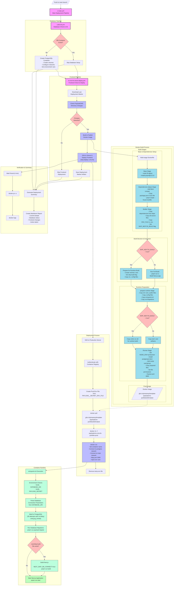

```mermaid
flowchart TB
    GitPush[/"Push to main branch"/] --> MainWorkflow["z-main.yml
    Main Deployment Pipeline"]
    
    MainWorkflow --> DBCheckInit
    
    subgraph "Database Pipeline"
        DBCheckInit["a-db-init.yml
        Database Check & Init"]
        DBCheckInit --> CheckDBExists{"DB Container
        Exists?"}
        CheckDBExists -->|No| CreateDB["Create PostgreSQL Container
        - Create volumes
        - Configure networks
        - Set environment vars"]
        CheckDBExists -->|Yes| SkipDB["Skip Database Setup"]
    end
    
    CreateDB --> CMSFECheck
    SkipDB --> CMSFECheck
    
    subgraph "Frontend Pipeline"
        CMSFECheck["b-cms-fe-check-deploy.yml
        Frontend Check & Deploy"]
        CMSFECheck --> DownloadMarker["Download Last
        Deployment Marker"]
        DownloadMarker --> DetectChanges["Check PayloadCMS
        Directory Changes"]
        DetectChanges --> ChangesExist{"Changes
        Detected?"}
        
        ChangesExist -->|Yes| BuildPublish["Build & Publish
        Docker Image"]
        BuildPublish --> DeployFE["SSH to Server &
        Deploy Frontend
        (step-deploy--cms-fe)"]
        DeployFE --> SaveMarker["Save Deployment
        Marker Artifact"]
        
        ChangesExist -->|No| SkipFE["Skip Frontend
        Deployment"]
    end
    
    subgraph "Docker Build Process"
        BuildPublish --> DockerBuildStages["Multi-stage Dockerfile"]
        
        subgraph "Build Stages"
            subgraph "Base & Dependencies Setup"
                DockerBuildStages --> BaseImage["Base Stage
                - node:20-alpine
                - Install pnpm@10.3.0"]
                BaseImage --> DepsStage["Dependencies (deps) Stage
                - Add libc6-compat
                - Copy package.json & lock file
                - pnpm install --frozen-lockfile"]
                DepsStage --> BuilderStage["Builder Stage
                - Copy dependencies from deps
                - Copy all source files
                - Copy ENV_FILE to .env
                - Set SKIP_NEXTJS_BUILD flag"]
            end
            
            subgraph "Build Decision & Execution"
                BuilderStage --> SkipNextBuild{"SKIP_NEXTJS_BUILD
                = true?"}
                SkipNextBuild -->|Yes| PrepareRuntime["Prepare for Runtime Build
                - Create minimal .next
                - Set skip-build flag
                - Copy src, config files"]
                SkipNextBuild -->|No| RunBuild["Run Full Build
                - pnpm run ci
                - Build Next.js app"]
            end
            
            subgraph "Runtime Preparation"
                PrepareRuntime --> RuntimePrep["prepare-runtime Stage
                - Copy env vars, public files
                - Copy config files
                - Copy entrypoint.sh
                - Copy src/migrations"]
                RunBuild --> RuntimePrep
                
                RuntimePrep --> RuntimeBuildCheck{"SKIP_NEXTJS_BUILD
                = true?"}
                RuntimeBuildCheck -->|Yes| CopySourceFiles["Copy entire src dir
                for runtime build"]
                RuntimeBuildCheck -->|No| CopyBuildOutput["Copy built .next
                artifacts"]
                
                CopySourceFiles --> RunnerStage
                CopyBuildOutput --> RunnerStage
            end
            
            subgraph "Final Image"
                RunnerStage["Runner Stage
                - Set NODE_ENV=production
                - Install postgresql-client
                - Add nextjs user/group
                - Copy prepared files
                - Set file permissions
                - Expose port 3000"]
                RunnerStage --> FinalDockerImage[/"Docker Image
                ghcr.io/pmeaney/template-payloadcms-portfolio2025:latest"/]
            end
        end
    end
    
    subgraph "Deployment Process"
        DeployFE --> SSHToServer["SSH to Production Server"]
        SSHToServer --> AuthGHCR["Authenticate with
        Container Registry"]
        AuthGHCR --> CreateEnvFile["Create Prod Env File
        from PAYLOAD__SECRET_ENV_FILE"]
        CreateEnvFile --> PullImage["docker pull
        ghcr.io/pmeaney/template-payloadcms-portfolio2025:latest"]
        PullImage --> RemoveOldContainer["docker rm -f
        payloadcms-cms-fe-portfolio-prod"]
        RemoveOldContainer --> RunContainer["docker run
        - Set container name
        - Connect to postgres network
        - Connect to main network
        - Map port 3000
        - Inject env vars"]
        RunContainer --> CleanupEnvFile["Remove temp env file"]
        
        FinalDockerImage -.-> PullImage
    end
    
    subgraph "Container Runtime"
        RunContainer --> EntrypointScript["entrypoint.sh Execution"]
        
        EntrypointScript --> EnvCheck["Environment Checks
        - Verify DATABASE_URI
        - Verify PAYLOAD_SECRET"]
        EnvCheck --> ParseDBParams["Parse Database
        Connection Parameters
        from DATABASE_URI"]
        ParseDBParams --> WaitForDB["Wait for PostgreSQL
        (30 attempts with 3s delay)
        using pg_isready"]
        
        WaitForDB --> RunMigrations["Run Database Migrations
        pnpm run payload:migrate"]
        RunMigrations --> CheckSkipBuildFlag{".next/skip-build
        file exists?"}
        
        CheckSkipBuildFlag -->|Yes| BuildNextJS["Build Next.js
        NEXT_SKIP_DB_CONNECT=true
        pnpm run build"]
        CheckSkipBuildFlag -->|No| StartApp["Start Next.js Application
        pnpm run start"]
        BuildNextJS --> StartApp
    end
    
    subgraph "Verification & Summary"
        DeployFE --> WaitPeriod["Wait Period (4 min)"]
        WaitPeriod --> CheckContainers["docker ps -a"]
        CheckContainers --> CheckLogs["docker logs
        <containerId>"]
        
        SkipDB --> DeploySummary["Generate Deployment
        Summary"]
        CreateDB --> DeploySummary
        SkipFE --> DeploySummary
        SaveMarker --> DeploySummary
        DeploySummary --> MarkdownReport["Create Markdown Report
        - Commit details
        - Database status
        - Frontend changes
        - Action taken"]
    end
    
    classDef workflow fill:#f9f,stroke:#333,stroke-width:2px
    classDef process fill:#bbf,stroke:#333,stroke-width:1px
    classDef decision fill:#fbb,stroke:#333,stroke-width:1px
    classDef container fill:#bfb,stroke:#333,stroke-width:1px
    classDef dockerstage fill:#9de,stroke:#333,stroke-width:1px
    classDef entrypoint fill:#bfd,stroke:#333,stroke-width:1px
    
    class MainWorkflow,DBCheckInit,CMSFECheck workflow
    class DetectChanges,BuildPublish,DeployFE,RunContainer process
    class CheckDBExists,ChangesExist,CheckSkipBuildFlag,SkipNextBuild,RuntimeBuildCheck decision
    class StartApp container
    class BaseImage,DepsStage,BuilderStage,PrepareRuntime,RunBuild,RuntimePrep,RunnerStage,CopySourceFiles,CopyBuildOutput dockerstage
    class EntrypointScript,EnvCheck,ParseDBParams,WaitForDB,RunMigrations,BuildNextJS entrypoint
```